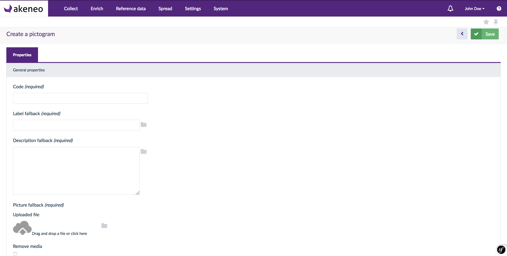
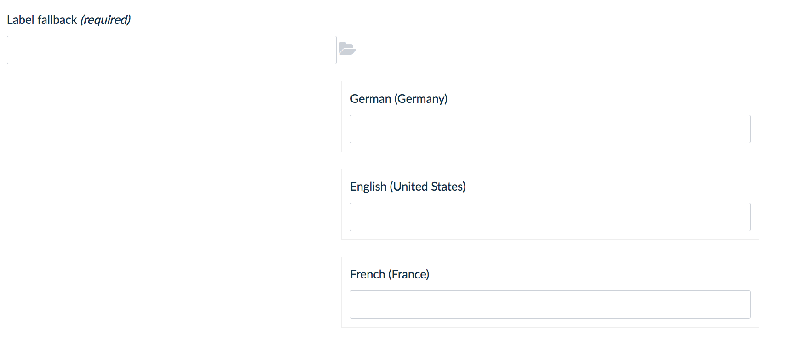
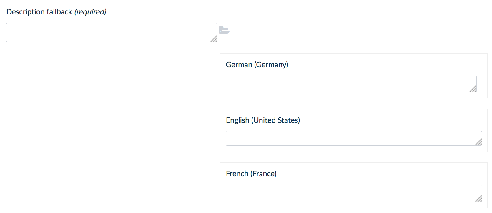
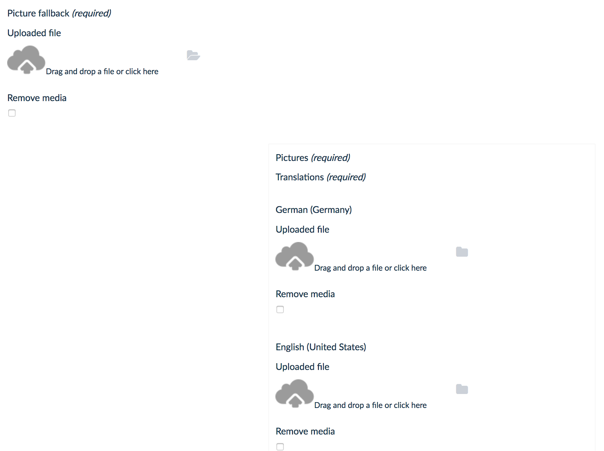

Akeneo Enrich Bundle by Kiboko  
==============================  

What this project is ?  
----------------------
The project is an enhancement of the CustomEntityBundle from Akeneo : 
https://github.com/akeneo-labs/CustomEntityBundle.

What the project does ?
-----------------------
This bundle helps developpers to create more quickly and easily custom reference data for your PIM
and related views in Akeneo.  

Why this project is useful ?
----------------------------
Custom PIM reference data are often required to meet each project's
business needs and specificities.

Need help ?  
-----------  
If you need help concerning this bundle you can reach the Kiboko developper team at :
hello@kiboko.fr or at +33 (0)471 027 223. We are open from 9am to 12:30pm and from 2pm to 5pm at Paris time.


How to: create a custom reference data
----------------------------------------------------

### The Kiboko entity helper traits
We built 3 helper traits for common attributes that constitue most of custom entity reference data.

* [*Labelled*](Model/LabeledTrait.php): A short text label
* [*Described*](Model/DescribedTrait.php): A long text description
* [*Pictured*](Model/PicturedTrait.php): A picture

All of three are translatable and use an optimized UX for PIM using lots of locales at the same time.

 
 
 
 

### The Custom Entity

First, you will have to create your custom entity class, in the following example we will call it `Pictogram`.  

```php
<?php

namespace MyProject\Bundle\PictogramBundle\Entity;

use Doctrine\Common\Collections\ArrayCollection;
use Kiboko\Bundle\EnrichBundle\Model\DescribedInterface;
use Kiboko\Bundle\EnrichBundle\Model\DescribedTrait;
use Kiboko\Bundle\EnrichBundle\Model\LabeledInterface;
use Kiboko\Bundle\EnrichBundle\Model\PicturedInterface;
use Kiboko\Bundle\EnrichBundle\Model\PicturedTrait;
use Kiboko\Bundle\EnrichBundle\Model\LabeledTrait;
use Kiboko\Bundle\EnrichBundle\Model\TranslatableCustomEntityTrait;

use Akeneo\Component\Localization\Model\TranslatableInterface;
use Pim\Component\ReferenceData\Model\ReferenceDataInterface;

class Pictogram implements
    TranslatableInterface,
    ReferenceDataInterface,
    DescribedInterface,
    LabeledInterface,
    PicturedInterface
{
    use TranslatableCustomEntityTrait;
    use DescribedTrait;
    use LabeledTrait;
    use PicturedTrait;

    /**
     * Pictogram constructor.
     */
    public function __construct()
    {
        $this->translations = new ArrayCollection();
    }

    /**
     * Returns the custom entity name used in the configuration
     * Used to map row actions on datagrid
     *
     * @return string
     */
    public function getCustomEntityName()
    {
        return 'pictogram';
    }

    /**
     * Get translation full qualified class name
     *
     * @return string
     */
    public function getTranslationFQCN()
    {
        return PictogramTranslation::class;
    }

    /**
     * @return string
     */
    public static function getLabelProperty()
    {
        return 'label';
    }

    /**
     * @return string
     */
    public static function getFallbackLabelProperty()
    {
        return 'labelFallback';
    }
}
``` 

As you can notice, the class is implementing five interfaces :  
* `ReferenceDataInterface` and `TranslatableInterface` from Akeneo bundles. If you need more information 
about them please refere to their documentation: https://docs.akeneo.com/1.7/index.html .
* `DescribedInterface`, `LabeledInterface` and `PicturedInterface` are provided by this bundle as helpers

The default implementation of the interfaces is made in traits:
* `TranslatableCustomEntityTrait`, for `TranslatableInterface` and `ReferenceDataInterface` concrete implementations 
* `DescribedTrait`  for `DescribedInterface` implementation
* `LabeledTrait` for `LabeledInterface` implementation
* `PicturedTrait` for `PicturedInterface` implementation

Check the *CustomEntityBundle* documentation for explanations of the other methods declared in the example.

### The Custom Entity Translation

If you wnt to managed translations you need to create a custom entity translation class, 
in the following example we will call it `PictogramTranslation`.  

```php
<?php
namespace Arc\Bundle\PictogramBundle\Entity;

use Akeneo\Component\Localization\Model\AbstractTranslation;
use Arc\Component\ReferenceData\Model\PictogramTranslationInterface;
use Kiboko\Bundle\EnrichBundle\Model\DescribedTranslationTrait;
use Kiboko\Bundle\EnrichBundle\Model\LabelledTranslationTrait;
use Kiboko\Bundle\EnrichBundle\Model\PicturedTranslationTrait;

class PictogramTranslation extends AbstractTranslation implements 
    LabeledTranslationInterface,
    DescribedTranslationInterface,
    PicturedTranslationInterface
{
    use DescribedTranslationTrait;
    use LabelledTranslationTrait;
    use PicturedTranslationTrait;
}
```

This class extends `AbstractTranslation` as stated by the CustomEntityBundle documentation.

It also have to implement the translation interface and use their corresponding translation helper traits :  
* `LabelledTranslationTrait` for `LabeledTranslationInterface` implementation
* `DescribedTranslationTrait` for `DescribedTranslationInterface` implementation  
* `PicturedTranslationTrait` for `PicturedTranslationInterface` implementation

### The Doctrine configuration

In doctrine folder create the custom entity mapping in `Resources/config/doctrine/Pictogram.orm.yml`  


```yaml
MyProject\Bundle\PictogramBundle\Entity\Pictogram:
    type: entity
    table: my_pictogram
    repositoryClass: Pim\Bundle\CustomEntityBundle\Entity\Repository\TranslatableCustomEntityRepository
    changeTrackingPolicy: DEFERRED_EXPLICIT
    fields:
        id:
            type: integer
            id: true
            generator:
                strategy: AUTO
        code:
            type: string
            length: 100
            unique: true
        labelFallback:
            type: string
            length: 100
            nullable: true
        descriptionFallback:
            type: text
            nullable: true
        created:
            type: datetime
            gedmo:
                timestampable:
                    on: create
        updated:
            type: datetime
            gedmo:
                timestampable:
                    on: update

    oneToMany:
        translations:
            targetEntity: MyProject\Bundle\PictogramBundle\Entity\PictogramTranslation
            mappedBy: foreignKey
            cascade:
                - persist
                - detach
    oneToOne:
        pictureFallback:
            targetEntity: Akeneo\Component\FileStorage\Model\FileInfo
            joinColumn:
                name: picture_id
                referencedColumnName: id
                onDelete: CASCADE
            cascade:
                - persist
```

For the `pictureFallback` field a oneToOne relation is required to the `FileInfo` model.  

In order to manage translations a oneToMany relation is required.  

If you want to manage translation you also need to create the mapping for the translation entity in `Resources/config/doctrine/PictogramTranslation.orm.yml`  

```yaml
MyProject\Bundle\PictogramBundle\Entity\PictogramTranslation:
    type: entity
    table: my_pictogram_translation
    changeTrackingPolicy: DEFERRED_EXPLICIT
    uniqueConstraints:
        locale_foreign_key_idx:
            columns:
                - locale
                - foreign_key
    fields:
        id:
            type: integer
            id: true
            generator:
                strategy: AUTO
        label:
            type: string
            length: 100
            nullable: true
        description:
            type: text
            nullable: true
        locale:
            type: string
            length: 20
    manyToOne:
        foreignKey:
            targetEntity: MyProject\Bundle\PictogramBundle\Entity\Pictogram
            inversedBy: pictograms
            joinColumns:
                foreign_key:
                    referencedColumnName: id
                    onDelete: CASCADE
    oneToOne:
        picture:
            targetEntity: Akeneo\Component\FileStorage\Model\FileInfo
            joinColumn:
                name: picture_id
                referencedColumnName: id
                onDelete: CASCADE
            cascade: [ persist ]
```

Again, for the `picture` field a oneToOne relation is required to the `FileInfo`model.

Don't forget to create migration file or update your schema:

* `app/console doctrine:migration:diff` (preferred)
* `app/console doctrine:schema:update --force` (*dangerous*, reserved for advanced users) 

### Datagrid configuration

Your custom entity is now declared, you need to realize the data grid configuration and the form mapping.  

In your bundle create a datagrid folder in it create yaml file: 
`Resources/config/datagrid/pictogram.yml`  

The section below configure the custom reference data entity to use.

```yaml
datagrid:
     pictogram:
         extends: pictogram-entity-grid
         options:
             entityHint: pictogram
             locale_parameter: localeCode
         source:
             type: pim_datasource_default
             entity: MyProject\Bundle\PictogramBundle\Entity\Pictogram
             repository_method: createDatagridQueryBuilder
         columns:
             code:
                 label: Code
             labelFallback:
                 label: Label
             localizedLabel:
                 label: Localized Label
                 data_name: translation.label
             pictureFallback:
                 label: Picture
                 type: twig
                 template: 'KibokoEnrichBundle:Datagrid:pictureColumn.html.twig'
                 data_name: pictureFallback
                 frontend_type: html
             created:
                 label: Created
                 type: product_value_datetime
                 frontend_type: datetime
             updated:
                 label: Updated
                 type: product_value_datetime
                 frontend_type: datetime
         properties:
             id: ~
             edit_link:
                 type: url
                 route: pim_customentity_edit
                 params:
                     - id
                     - customEntityName
             delete_link:
                 type: url
                 route: pim_customentity_delete
                 params:
                     - id
                     - customEntityName
         actions:
             edit:
                 type:      navigate
                 label:     Edit the pictogram
                 icon:      edit
                 link:      edit_link
                 rowAction: true
             delete:
                 type:  delete
                 label: Delete the pictogram
                 icon:  trash
                 link:  delete_link
         filters:
             columns:
                 code:
                     type:      string
                     label:     Code
                     data_name: rd.code
                 labelFallback:
                     type:      string
                     label:     Label
                     data_name: pictogram.labelFallback
                 created:
                     type:             date
                     label:            Created
                     data_name:        rd.created
                     filter_by_having: true
                 updated:
                     type:             date
                     label:            Updated
                     data_name:        rd.udapted
                     filter_by_having: true
         sorters:
             columns:
                 code:
                     data_name: rd.code
                 labelFallback:
                     data_name: pictogram.labelFallback
                 created:
                     data_name: rd.created
                 updated:
                     data_name: rd.udapted
             default:
                 code: '%oro_datagrid.extension.orm_sorter.class%::DIRECTION_ASC'
```

### Creating the Form Type for creation and edition

In your bundle create a Form folder, and a subfolder Type.  
Add inside this folder create the custom entity type class that extends CustomEntityType.  
In our exemple we call it PictogramType.

```php
<?php
namespace  MyProject\Bundle\PictogramBundle\Form\Type;

use Kiboko\Bundle\EnrichBundle\Form\EventListener\PicturedFormListener;
use Pim\Bundle\CustomEntityBundle\Form\Type\CustomEntityType;
use Pim\Bundle\EnrichBundle\Form\Subscriber\DisableFieldSubscriber;
use Symfony\Component\Form\FormBuilderInterface;
use Symfony\Component\OptionsResolver\OptionsResolverInterface;

class PictogramType extends CustomEntityType
{
    private $formListener;

    public function __construct(PicturedFormListener $formListener)
    {
        $this->formListener = $formListener;
    }

    public function buildForm(FormBuilderInterface $builder, array $options)
    {
        parent::buildForm($builder, $options);
        $builder
            ->add(
                'labelFallback',
                'text',
                [
                    'label'             => 'my_pictogram.form.field.labelFallback.label'
                ]
            )
            ->add(
                'label',
                'pim_translatable_field',
                [
                    'label'             => 'my_pictogram.form.field.label.label',
                    'field'             => 'label',
                    'translation_class' => $options['translation_class'],
                    'entity_class'      => $options['data_class'],
                    'property_path'     => 'translations',
                ]
            )
            ->add(
                'descriptionFallback',
                'textarea',
                [
                    'label'             => 'my_pictogram.form.field.descriptionFallback.label'
                ]
            )
            ->add(
                'description',
                'pim_translatable_field',
                [
                    'label'             => 'my_pictogram.form.field.description.label',
                    'field'             => 'description',
                    'translation_class' => $options['translation_class'],
                    'entity_class'      => $options['data_class'],
                    'property_path'     => 'translations',
                    'widget'            => 'textarea'
                ]
            )
            ->add(
                'pictureFallback',
                'kiboko_enrich_media',
                [
                    'label'             => 'my_pictogram.form.field.pictureFallback.label',
                ]
            )
            ->add(
                'picture',
                'kiboko_translatable_field',
                [
                    'label'             => 'my_pictogram.form.field.picture.label',
                    'field'             => 'picture',
                    'translation_class' => $options['translation_class'],
                    'entity_class'      => $options['data_class'],
                    'property_path'     => 'translations',
                    'widget'            => 'kiboko_enrich_media'
                ]
            )
            ->addEventSubscriber(new DisableFieldSubscriber('code'))
            ->addEventSubscriber($this->formListener);
    }

    /**
     * {@inheritdoc}
     */
    public function setDefaultOptions(OptionsResolverInterface $resolver)
    {
        $resolver->setRequired(['translation_class']);
    }

    public function getName()
    {
        return 'my_pictogram';
    }
}
```
 For each kiboko model you will use, you need to add to your form builder the correct mapping.  
 In our exemple we mapped label, description and picture models with their respective translatation field.  
 
 This class also need to implement :
 - `getName()`: return the form custom entity type name
 - `setDefaultOption(OptionsResolverInterface $resolver)`: require to manage models translations  
 
Now let's see to configure doctrine for our custom entity.

### The Form Type configuration file

In the config folder of your bundle create a yaml file named 'form_types.yml'.  
`Resources/config/form_types.yml`  

This is where you have to mappe a form type with your custom data reference entity.
```yaml
parameters:
  my_pictogram.form.type.pictogram.class: MyProject\Bundle\PictogramBundle\Form\Type\PictogramType

services:

  my_pictogram.form.type.pictogram:
      class: '%my_pictogram.form.type.pictogram.class%'
      arguments: ['@kiboko_enrich.form.event_subscriber']
      tags:
          - { name: form.type, alias: my_pictogram }

```

### The Custom Entities configuration file

In the config folder of your bundle create a yaml file named 'custom_entities.yml'.  
`Resources/config/custom_entities.yml`  

This is where you have to define the services used for each action used in your datagrid.
```yaml
custom_entities:
    pictogram:
        entity_class: MyProject\Bundle\PictogramBundle\Entity\Pictogram
        actions:
            index:
                service: pim_custom_entity.action.index
            create:
                form_type: my_pictogram
                form_options:
                    translation_class: MyProject\Bundle\PictogramBundle\Entity\PictogramTranslation
                service: pim_custom_entity.action.create
                template: MyPictogramBundle:Pictogram:form.html.twig
            edit:
                form_type: my_pictogram
                form_options:
                    translation_class: MyProject\Bundle\PictogramBundle\Entity\PictogramTranslation
                service: pim_custom_entity.action.edit
                template: MyPictogramBundle:Pictogram:form.html.twig

```

### Form view  

Now you are ready to create your custom entity form view.  
Create in the views folder of your bundle a twig file named `form.html.twig` as specified in your 
custom entities configuration file.  
`Resources/views/form.html.twig`  


```html











    <div class="AknTabContainer">
        {{ elements.form_navbar(['properties']) }}

        <div class="AknTabContainer-content tab-content">

            {{ elements.form_errors(form) }}

            <div class="tab-pane active" id="properties">
                
                    <div class="tabsections">
                        <div class="tabsection">
                            <div class="tabsection-title">{{ 'pane.accordion.general_properties' | trans }}</div>
                            <div class="tabsection-content">
                                <div class="AknFormContainer AknFormContainer--withPadding">
                                    {{ form_row(form.code) }}
                                    {{ form_row(form.labelFallback) }}
                                    {{ form_row(form.label, {'attr': {'class': 'labelBlock'}}) }}
                                    {{ form_row(form.descriptionFallback) }}
                                    {{ form_row(form.description, {'attr': {'class': 'descriptionBlock'}}) }}
                                    {{ form_row(form.pictureFallback) }}
                                    {{ form_row(form.picture, {'attr': {'class': 'pictureBlock', 'displayFolder': false}}) }}
                                </div>
                            </div>
                        </div>
                    </div>
                
            </div>
        </div>
    </div>
    <style>
        .labelBlock, .descriptionBlock, .pictureBlock.AknFieldContainer {
            display: none;
            width: 500px;
            margin-left: 400px;
            background-color: white;
            border: 1px solid rgb(238, 238, 238);
            padding: 10px;
        }
        .labelBlock:after, .descriptionBlock:after, .pictureBlock.AknFieldContainer:after {
            clear: both;
        }
    </style>
    <script type="text/javascript">
require(['jquery'], function($) {
    var labelFolder = $('#labelFallbackFolder');
    var descriptionFolder = $('#descriptionFallbackFolder');
    var pictureFolder = $('#pictureFallbackFolder');

    labelFolder.click(function() {
        if(labelFolder.hasClass('icon-folder-close')) {
            labelFolder.removeClass('icon-folder-close').addClass('icon-folder-open');
        }else {
            labelFolder.removeClass('icon-folder-open').addClass('icon-folder-close');
        }

        $('.labelBlock').toggle();
    });

    descriptionFolder.click(function() {
        if(descriptionFolder.hasClass('icon-folder-close')) {
            descriptionFolder.removeClass('icon-folder-close').addClass('icon-folder-open');
        }else {
            descriptionFolder.removeClass('icon-folder-open').addClass('icon-folder-close');
        }
        $('.descriptionBlock').toggle();
    });

    pictureFolder.click(function() {
        if(pictureFolder.hasClass('icon-folder-close')) {
            pictureFolder.removeClass('icon-folder-close').addClass('icon-folder-open');
        }else {
            pictureFolder.removeClass('icon-folder-open').addClass('icon-folder-close');
        }
        $('.pictureBlock.AknFieldContainer').toggle();
    });
});
    </script>

```


Kiboko, who we are ?
====================


Contributing
====================
